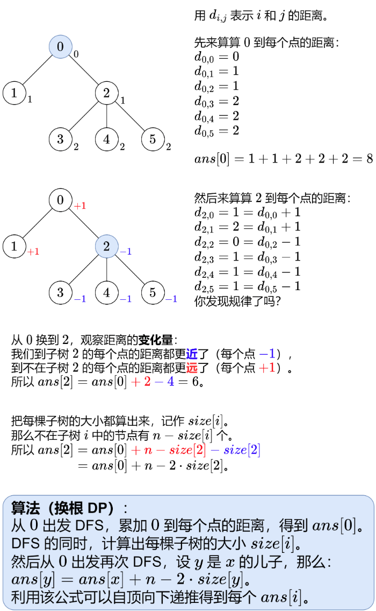

> Problem: [2581. 统计可能的树根数目](https://leetcode.cn/problems/count-number-of-possible-root-nodes/description/)

# 思路

> 換根Dp



答疑
Q：子樹大小是怎麼算的？

答：先說二元樹，子樹x的大小等於左子樹的大小，加上右子樹的大小，再加上 $1$ （節點 $x$ 本身），那麼後序遍歷這棵樹，就可以算出每棵子樹的大小。不清楚流程的同學，需要學習「遞迴」「子問題」等概念，具體請看【基礎演算法精講09】。然後推廣到一般樹，子樹 $x$ 的大小，等於x的所有兒子的子樹大小之和，再加上 $1$（節點 $x$ 本身）。

Q：在 $DFS$ 中，如何保證每個節點只遞歸一次存取？

答：通用做法是用一個顯示總是數組標記訪問過的點，如果某個點之前訪問過，就不再遞歸訪問。但對於樹來說，一直向下遞歸，並不會遇到之前訪問過的點，所以不需要顯示\textit{顯示}總是數組。本題是無向樹，除了根節點以外，其餘每個點的鄰居都包含其父節點，所以要避免存取父節點。我們可以定義 $\textit{dfs}(x,\textit{fa})$ 表示遞迴到節點 $x$ 且 $x$ 的父節點為 $fa$ 。只要 $x$ 的鄰居 $\ne \textit{fa}$ 和 $=fa$ ，就可以 $\textit{dfs}(y,x)$ 向下遞歸了。

問：這種算法的本質是什麼？

答：以圖中的這棵樹為例，從「以 $0$ 為根」換到「以 $2$ 為根」時，原來 $2$ 的子節點還是 $2$ 的子節點，原來 $1$ 的子節點還是 $1$ 的子節點，唯一改變的是  $0$  和  $2$  的父子關係。由此可見，一對節點的距離的「變化量」應該是很小的，那麼找出「變化量」的規律。這種算法叫做換根DP。

```
作者：灵茶山艾府
链接：https://leetcode.cn/problems/sum-of-distances-in-tree/solutions/2345592/tu-jie-yi-zhang-tu-miao-dong-huan-gen-dp-6bgb/
来源：力扣（LeetCode）
著作权归作者所有。商业转载请联系作者获得授权，非商业转载请注明出处。
```

# 复杂度

时间复杂度:
> $O(n)$

空间复杂度:
> $O(n)$

# Code
```C++ []
using LL = long long;
class Solution {
public:
    int rootCount(vector<vector<int>>& edges, vector<vector<int>>& guesses, int k) {
        vector<vector<int>> g(edges.size() + 1);
        for (auto& e : edges)
        {
            int x = e[0], y = e[1];
            g[x].push_back(y);
            g[y].push_back(x);
        }
        unordered_set<LL> s;
        for (auto& g: guesses)
        {
            s.insert((LL) g[0] << 32 | g[1]);
        }

        int ans = 0, cnt0 = 0;
        function<void(int, int)> dfs = [&](int x, int fa)
        {
            for (int y : g[x])
            {
                if (y != fa)
                {
                    cnt0 += s.count((LL) x << 32 | y);
                    dfs(y, x);
                }
            }
        };
        dfs(0, -1);
        
        function<void(int,int,int)> rer = [&](int x, int fa, int cnt)
        {
            ans += cnt >= k;
            for (int y : g[x])
            {
                if (y != fa)
                {
                rer(y, x, cnt 
                    - s.count((LL) x << 32 | y)
                    + s.count((LL) y << 32 | x)
                    );
                }
            }
        };
        rer(0 , -1, cnt0);
        return ans;
    }
};
```
  
