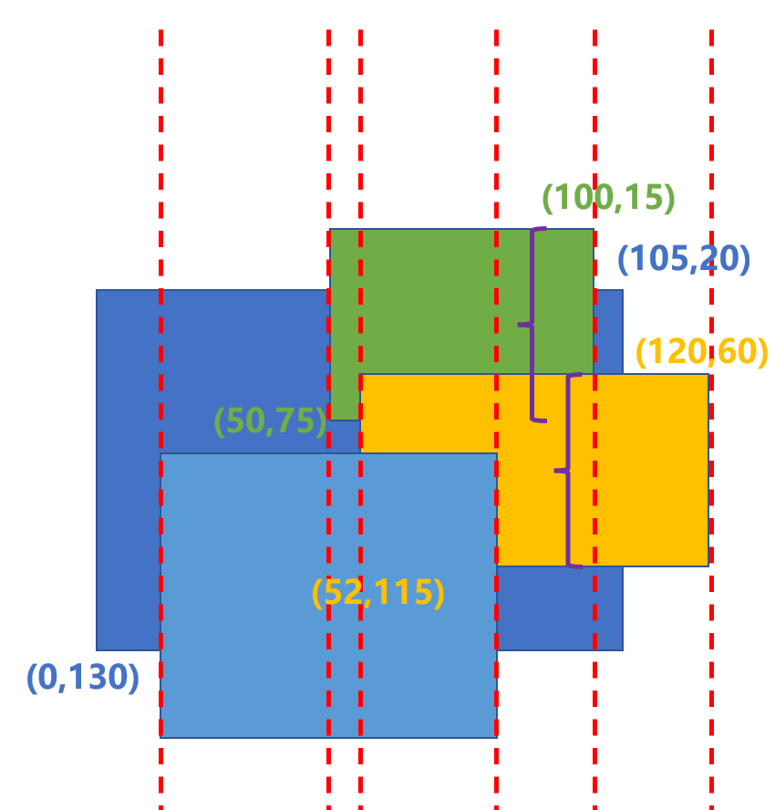

> Problem: [P2745 [USACO5.3] 窗体面积Window Area](https://www.luogu.com.cn/problem/P2745)

# 思路
- 這個問題本質上是求某個目標視窗上方所有視窗區域的並集與該視窗區域的交集。

1. 求目標視窗上方所有視窗區域的並集
2. 利用這個並集與目標視窗區域相交，得到目標視窗的被覆蓋區域
3. 目標視窗總面積減去覆蓋面積即為可見面積。

# 實現方法
"掃線"算法
- 對於所有垂直邊緣，繪製無限長的直線以形成單獨的區域。計算這些區域內的面積。


- 以圖中的紫色大括號為例，實際上是在計算該區域內兩個視窗的垂直座標區間的並集：
> $[15, 75] \cup [60,115]$ = $[15, 115]$ 。

- 與目標視窗的垂直座標區間相交：
> $[20, 130] \cap [15, 115]$ = $[20, 115]$

假設該區域的寬度為20，則該區域中目標視窗的覆蓋面積為20*(115-20) = 1900。



- 收集矩形：建立一個名為 cur 的數組，用於儲存目標矩形以及目標矩形上方的其他矩形。

- 遍歷鏈表中的所有矩形。對於每個矩形 $r$ ，如果其字元 $c$ 與指定字元相同，或者 $cur$ 數組已經有元素（即 $cur.size()$ 為 true），則將這個矩形加入 $cur$ 數組中。
* 當我們找到第一個符合指定字元的矩形（即目標矩形）並將其新增至 $cur$ 數組時，cur.size() 將變為 true。
* 然後，在後續迭代中，無論矩形r的字元c是否與指定字元相同，只要 $cur$ 數組已經有元素，我們就將矩形 $r$ 加入 $cur$ 數組中。 所以這段程式碼實際上保存了目標矩形及其上方的所有矩形。

# 取得X座標
- 收集目標矩形X座標範圍內所有矩形的X座標，並排序。
* 建立一個名為 $xs$ 的數組來儲存X座標。 迭代 $cur$ 數組中的所有矩形。 對於每個矩形 $r$ ，如果其左邊界 $(r.a.x)$  或右邊界 $(r.b.x)$ 在第一個矩形（目標矩形）的X 座標範圍內（即在 $cur[0].a.x$ 和 $cur[0].b.x$ 之間），然後將該邊界的 $X$ 座標加入 xs 數組。
- 計算交集：建立一個名為 $q$ 的數組(優先隊列)來儲存 $Y$ 座標範圍。然後迭代$cur$ 數組中的所有矩形，找到那些在目前 $X $座標範圍內的矩形，並將它們的Y座標範圍加入q數組。 對 $q$ 數組中的所有 $Y$ 座標範圍進行排序，然後計算它們與目標矩形 $Y$ 座標的交集。
- 計算百分比：最後計算被覆蓋的面積佔第一個矩形面積的百分比並傳回結果。

# 复杂度
- 时间复杂度:
> $O(N^2)$

- 空间复杂度:
> $O(1)$
  
# Code
```C++ 
#include <iostream>
#include <algorithm>
#include <vector>
#include <climits>
#include <string>
#include <queue>
#include <unordered_map>
#include <unordered_set>
#include <list>
// #include <map>
using namespace std;

typedef long long LL;
typedef long long int lli;
typedef unsigned long long ull;
typedef pair<int, int> PII;
typedef pair<LL, LL> PLL;
const int INF = 0x7f7f7f7f; // 最大值2139062143。用於代替INT_MAX 
const int N = 1e5 + 10; // 用於定義常量數組
#define MAXN ((int) 1e5) //
#define MAXM ((int) 1e5)
#define MAXPROD ((int) 1e5)

struct Rect
{
	char c;
	PII a, b;
};
list<Rect> rect;

int get_intersection(int a, int b, int c, int d)
{
	if (b <= c || d <= a) return 0;
	return min(b, d) - max(a, c);
}

double area(char ch)
{
	vector<Rect> cur;
	for (auto r : rect)
	{
		if (r.c == ch || cur.size())
			cur.push_back(r);
	}
	vector<int> xs;
	auto& [tx1, ty1] = cur[0].a;
	auto& [tx2, ty2] = cur[0].b;
	for (int i = 0; i < cur.size(); ++i)
	{
		auto& r = cur[i];
		auto& [x1, y1] = r.a;
		auto& [x2, y2] = r.b;
		if (x1 >= tx1 && x1 <= tx2)
			xs.push_back(x1);
		if (x2 >= tx1 && x2 <= tx2)
			xs.push_back(x2);
	}
	sort(xs.begin(), xs.end());
	int area = 0;
	for (int i = 0; i < xs.size() - 1; ++i)
	{
		if (xs[i] != xs[i + 1])
		{
			int a = xs[i], b = xs[i + 1];
			vector<PII> q; // 優先隊列
			for (int j = 1; j < cur.size(); ++j)
			{
				auto& r = cur[j];
				auto& [x1, y1] = r.a;
				auto& [x2, y2] = r.b;
				if (x1 <= a && x2 >= b)
					q.push_back({ y1, y2 });
			}
			if (q.size())
			{
				sort(q.begin(), q.end());
				auto [st, ed] = q[0];
				for (int j = 1; j < q.size(); ++j)
				{
					auto& [sst, sed] = q[j];
					if (sst <= ed) 
						ed = max(ed, sed);
					else
					{
						area += get_intersection(st, ed, ty1, ty2) *
							(b - a);
						st = sst, ed = sed;
					}
				}
				area += get_intersection(st, ed, ty1, ty2) * (b - a);
			}
		}
	}
	return (1 - (double)area / (tx2 - tx1) / (ty2 - ty1)) * 100;
}

int main()
{
	char op;
	while (cin >> op)
	{
		if (op == 'w')
		{
			char c;
			int x1, x2, y1, y2;
			scanf("(%c,%d,%d,%d,%d)", &c, &x1, &y1, &x2, &y2);
			rect.push_back({ c, {min(x1,x2), min(y1,y2)}, {max(x1,x2),max(y1,y2)} });
		}
		else
		{
			char c;
			scanf("(%c)", &c);
			list<Rect>::iterator it;
			for (auto i = rect.begin(); i != rect.end(); ++i)
			{
				if (i->c == c)
				{
					it = i;
					break;
				}
			}
			if (op == 't')
			{
				rect.push_back(*it);
				rect.erase(it);
			}
			else if (op == 'b')
			{
				rect.push_front(*it);
				rect.erase(it);
			}
			else if (op == 'd')
				rect.erase(it);
			else
				printf("%.3lf\n", area(c));
		}
	}
	return 0;
}
```